# 设计模式Demo

## 设计模式总结
> 推荐书籍：《图解设计模式》、《设计模式-可复用面向对象软件的基础》

### GOF23种设计模式的归纳和总结

<b>

分类|设计模式
:-|:-
创建型|工厂方面模式`Factory-Method`、抽象工厂模式`Abstract-Factory`、建造者模式`Builder`、原型模式`Prototype`、单例模式`Singletion`
结构型|适配器模式`Adapter`、桥接模式`Bridge`、组合模式`Composite`、装饰器模式`Decorator`、门面模式`Facade`、享元模式`Flyweight`、代理模式`Proxy`
行为型|解释器模式`Interpreter`、模板方法模式`Template Method`、责任链模式`Chain of Responsibility`、命令模式`Command`、迭代器模式`Iterator`、调解者模式`Mediator`、备忘录模式`Memento`、观察者模式`Observer`、状态模式`State`、策略模式`Strategy` 访问者模式`Visitor`

### 一句话总结

设计模式|总结|举例
:-|:-|:-
工厂模式`Factory`|封装创建过程，完成new的动作|BeanFactory、Calender
单例模式`Singletion`|保证某种场景下唯一 （全局唯一、线程里唯一、某个业务下唯一）|ApplicationContext
原型模式`Prototype`|批量生产|PrototypeBean
代理模式`Proxy`|代为处理，增强职能|ProxyFactoryBean、JdkDynamicAopProxy、CglibAopProxy
委派模式`Delegate`|干活算你的（普通员工），劳算我的（项目经理）|DispatcherServlet、BeanDefinitionParserDelegate
策略模式`Strategy`|弱水三千，只取一瓢|InstantiationStrategy
模板模式`Template`|流程标准化，步骤多样化|JdbcTemplate、HttpServlet
适配器模式`Adapter`|兼容转接头|AdvisorAdapter、HandlerAdapter
装饰器模式`Decorator`|包装，同宗同源|BufferedReader、InputStream OutputStream、HttpHeadResponseDecorator
观察者模式`Observer`|通知一些人做事情|ContextLoaderListener

### 代码片段 

1. 工厂模式：通过封装复杂的算法来产生固定的Java实例一个代码组合（类的组合）。 

   代码示例： 
   IOC中的BeanFactory(`DefaultListableBeanFactory`) 以及其子类实现的`getBean`的方法就是典型的工厂方法。 
   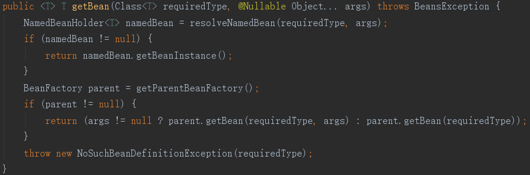

2. 单例模式：在任何情况下这个Java类都只被创建了一次并且提供访问入口。 

   代码示例： 
   IOC中bean的默认初始化的类型是singleton就会进入 
   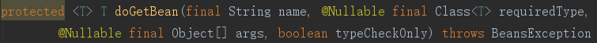 
   方法中代码： 
   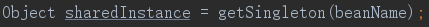 
   此处明确表示它是创建并获取一个单例的方法，并且在spring的生命周期以内都需要通过`getBean()`这个访问入口去获取bean的实例。 

3. 原型模式：不通过new关键字来创建对象而是通过拷贝来创建新的和原来一模一样的对象。 

   代码示例： 
   `DefaultListableBeanFactory`中获取beanname的数组方法 
   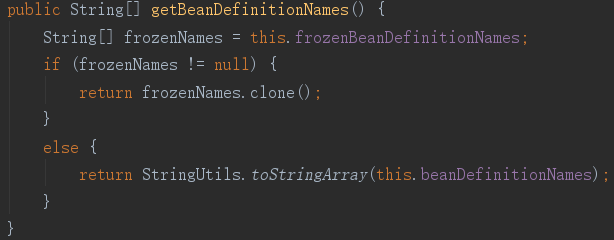 
   这个方法中的代码 
   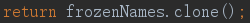 
   就是原型模式，防止beanname数组数据被使用者修改，破坏框架的使用。 

4. 代理模式：在代理的方法中调用要代理的方法，并在有代理的方法之前获释之后做一些统一的操作来增强原来方法功能。 

   代码示例： 
   AOP切面编程的`AbstractAutoProxyCreator`中的 
   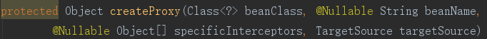 
   这个方法就是创建代理类的方法。通过代理来对类的创建之前和之后做相关的操作。这个方法再调用jdk或是cglib动态代理来生成代理类再将创建的实例放入IOC容器。 

5. 委派模式：通过一个逻辑判断来调度和分配要任务实际完成者，这个过程任务发布者不关心谁执行了任务只关心任务是否完成。 

   代码示例： 
   在springmvc中请求的处理就是一个典型委派模式不同的请求调用不同的handler去处理请求 
   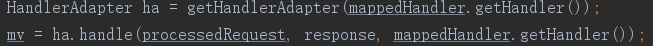 

6. 策略模式:根据不同的场景设计不同的逻辑和算法来完成相同的目的，他们之间相互可以替换。 

   代码示例： 
   Spring在实例化bean的时候有一个类`AbstractAutowireCapableBeanFactory`的 
   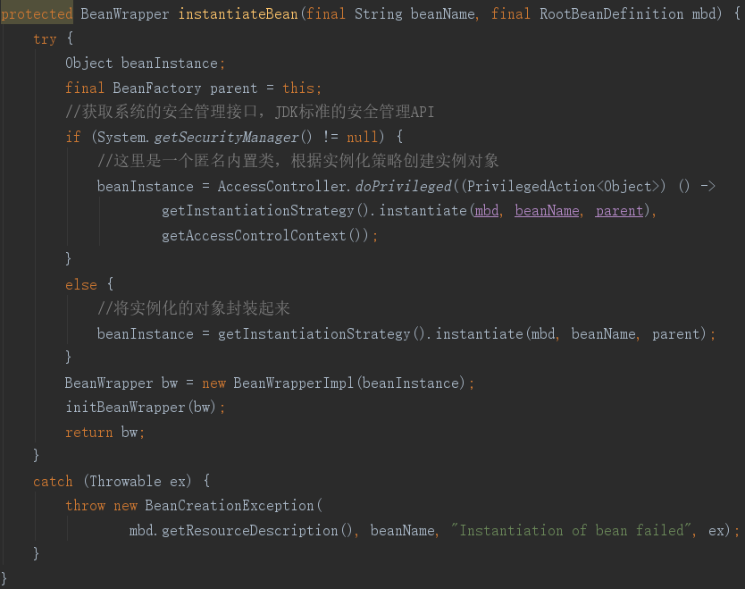 
   方法，这个方法中的 
   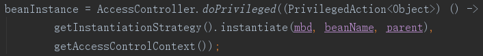 
   从这里就可以看到它使用策略模式来实例化一个bean，查看这个策略一共有两个实现类，一个是简单的实例化，一个是cglib的的实例化，由此可以看出一个是直接实例化一个是通过代理去实例化。 

7. 模板模式：将一些子类有公共逻辑或算法的部分提取出来形成一个模板，可变的部分子类自己去实现的这种方式称为模板模式。体现了Java特性中的多态。比如一个简历模板，不可变的是简历的格式，可变的是简历的内容。 

   代码示例： 
   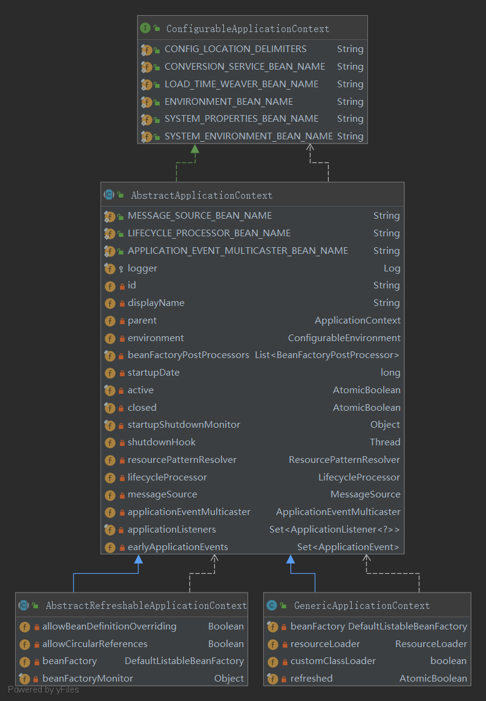 

8. 适配器模式：将原来不兼容的两个接口通过方法适配的方式使其可以可以一起调用。 

   代码示例： 
   在springmvc中请求分发处理方法 
   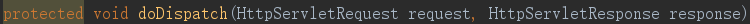 
   中的获取处理器适配器 
   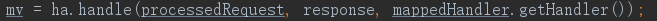 
   就使用了适配器模式通过适配不同的请求处理handler来执行不同的逻辑。 

9. 装饰者模式（包装模式）：在不改变原有对象逻辑的基础之上添加扩展的功能，包装以后他是一个包装对象，可以通过静态代理去实现，他和静态代理的不同是包装模式添加的功能和原有逻辑有一定的关系。他是继承方案的补充。 

   代码示例： 
   `BeanDefinitionDecorator`的子类 
   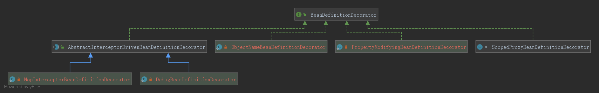 
   在创建bean描述的时候对代理类型的bean的描述进行了包装扩展。 

10. 观察者模式：将需要监听的对象主体添加到多个监听者之上，一旦主体发生改变就监听类就能收到主体改变的信息，来做相应的操作。 

       代码示例： 
       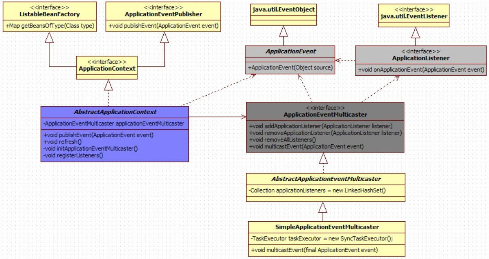 
       在环境刷新的时候进行监听 
